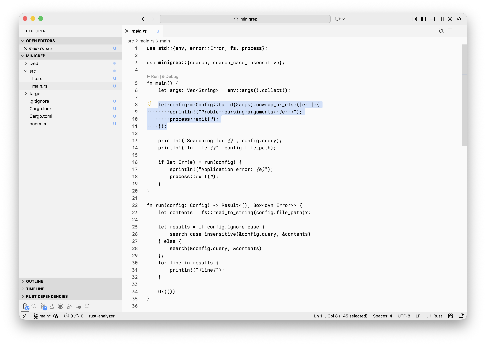
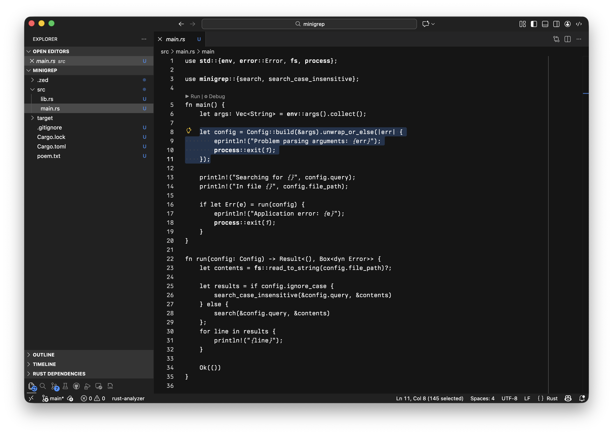

# vscode-alpental-theme

Minimal VS Code theme focused on typography.

## Screenshots





## Prerequisites

- Install the [veneer-theme](https://github.com/ascarter/veneer-theme) CLI used to build the theme assets:
  ```sh
  cargo install --git https://github.com/ascarter/veneer-theme
  ```
- Install [just](https://just.systems) for running the task recipes:
  ```sh
  brew install just
  ```
- Node.js & npm (for packaging with `vsce`).
- VS Code command-line tools (`code` on your PATH) for local installation.

Then pull down dev dependencies (installs `vsce`):
```sh
npm install
```

## Build

- Generate the compiled theme files:
  ```sh
  just build
  ```

The output ends up in `themes/` and is what gets packaged for VS Code.

## Justfile tasks

- `just build` (default): Build the VS Code theme JSON from the `src/*.json.tera` templates using `veneer`.
- `just vsix`: Build then package a `.vsix` using `vsce package` (output lands in repo root as `alpental-vscode-theme-<version>.vsix`).
- `just install`: Build, package, and install the newest `.vsix` into VS Code via `code --install-extension`.
- `just clean`: Remove generated build output and any `.vsix` files.

## Install locally

After `just vsix` or `just install`, you can install the packaged extension directly:

```sh
just install
```

If you prefer manual installation, locate the latest `alpental-vscode-theme-*.vsix` in the repo root and run:

```sh
code --install-extension ./alpental-vscode-theme-0.0.1.vsix
```
